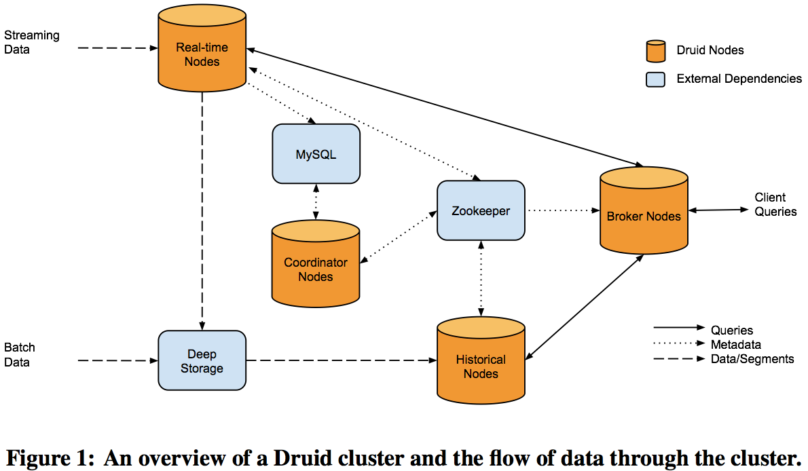
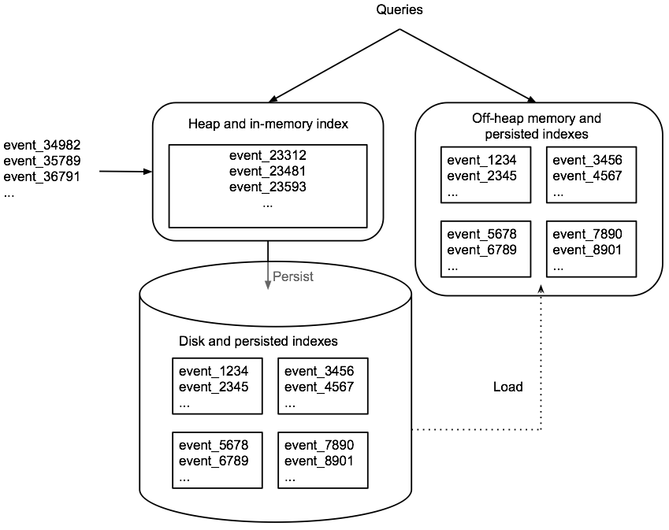
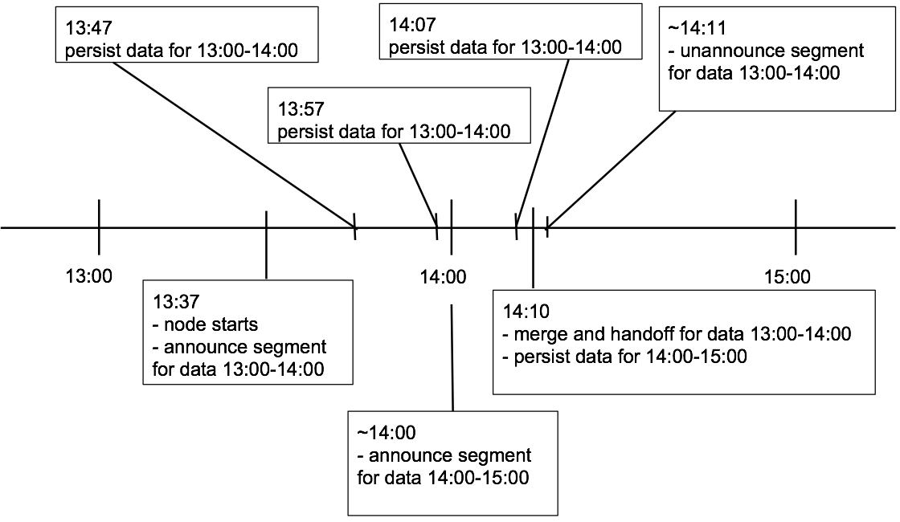
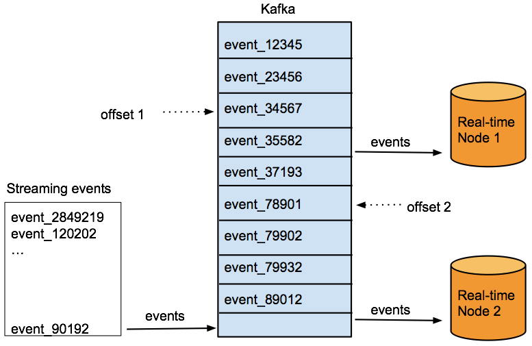
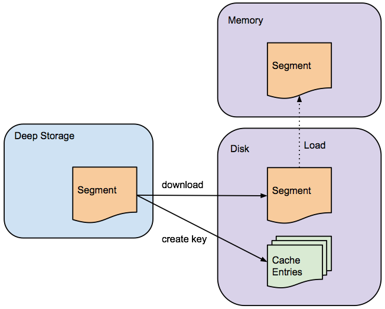
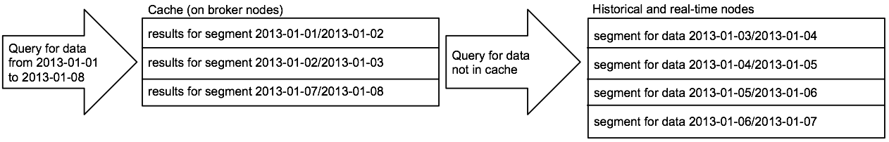

# Druid (实时统计分析数据存储)

**_原文见此_**: [Druid White Paper](http://static.druid.io/docs/druid.pdf)

## 摘要

[Druid](http://druid.io)是一个为在大数据集之上做实时统计分析而设计的开源数据存储。这个系统集合了一个面向列存储的层，一个分布式、shared-nothing的架构，和一个高级的索引结构，来达成在秒级以内对十亿行级别的表进行任意的探索分析。在这篇论文里面，我们会描述Druid的架构，和怎样支持快速聚合、灵活的过滤、和低延迟数据导入的一些细节。

## 1. 介绍

在最近几年，互联网技术的快速增长已经产生了大量由机器产生的数据。单独来看，这些数据包含很少的有用信息，价值都是很低的。从这些巨大的数据里面分析出有用的信息需要大量的时间和资源，很多公司都选择了放弃这些数据。虽然已有基础设施来处理这些居于事件的数据（例如IBM的Netezza，惠普的Vertica，EMC的Green-plum），但它们大多以高价售卖，那些负担得起的公司才是他们的目标客户。

几年前，Google推出了MapReduce，他们利用普通硬件来索引互联网和分析日志的机制。在原始的MapReduce论文公布之后，Hadoop很快就被大量的跟随和作为参考。Hadoop现在被很多组织机构部署来用于存储和分析大规模的日志数据。Hadoop很大的贡献在于帮助企业将他们那些低价值的事件流数据转化为高价值的聚合数据，这适用于各种应用，例如商业智能和AB测试。

和许多伟大的系统一样，Hadoop开阔了我们处理问题的视野。然而，Hadoop擅长的是存储和获取大规模数据，但是它并不提供任何性能上的保证它能多快获取到数据。此外，虽然Hadoop是一个高可用的系统，但是在高并发负载下性能会下降。最后，Hadoop对于存储数据可以工作得很好，但是并没有对数据导入进行优化，使导入的数据立即可读。

早在Metamarkets的产品开发过程中，我们遇上了所有这些问题，并意识到Hadoop是一个很好的后端、批量处理和数据仓库系统。然而，作为一个需要在高并发环境下（1000+用户）保证查询性能和数据可用性的公司，并需要提供产品级别的保证，Hadoop并不能满足我们的需求。我们在宇宙中探索了不同的解决方案，在尝试了关系型数据库管理系统和NoSQL架构后，我们得出了一个结论，就是在开源的世界里，并没有可以充分满足我们需求的系统。最后我们创建了Druid，一个开源的、分布式、列存储、实时分析的数据存储。在许多方面，Druid和其他OLAP系统有很多相似之处，交互式查询系统，内存数据库(MMDB)，众所周知的分布式数据存储。其中的分布式和查询模型都参考了当前的一些搜索引擎的基础架构。

本文介绍了Druid的架构，探讨了建立一个用于生产环境并保持永远在线的托管服务所做的各种设计决策，并试图帮助任何一位面临类似问题的人提供一个可能的解决方案。Druid已经在好几个技术公司的生产环境中进行了部署。本文的结构如下：我们首先在第2节描述面临的问题，接着我们在第3节详细介绍系统的架构，说明数据在系统里面是怎样流通的，然后会在第4节讨论数据为什么和怎么样转换为二进制格式，第5节会简要介绍下查询接口，第6节会介绍下现有的一些性能结果，最后，我们在第7节说明怎样将Druid运行于生产环境，第8节介绍下一些相关的工作。

## 2. 问题定义

Druid的最初目的是设计来解决导入和分析大规模交易事件（日志数据）。这种时间序列形式的数据通常在OALP类工作流中比较常见，且数据的本质是非常重的追加写。

**表1: 在Wikipedia由编辑产生的Druid示例数据**

Timestamp | Page | Username | Gender | City | Characters Added | Characters Removed
--------- | ---- | -------- | ------ | ---- | ---------------- | ----------
2011-01-01T01:00:00Z | Justin Bieber | Boxer | Male | San Francisco | 1800 | 25
2011-01-01T01:00:00Z | Justin Bieber | Reach | Male | Waterloo | 2912 | 42
2011-01-01T02:00:00Z | Ke$ha | Helz | Male | Calgary | 1953 | 17
2011-01-01T02:00:00Z | Ke$ha | Xeno | Male | Taiyuan | 3194 | 170

例如，考虑下表1包含的数据，表1包含了在Wikipedia编辑而产生的数据。每当用户编辑一个Wikipedia的页面的时候，就会产生一条关于编辑的包含了元数据的事件数据，这个元数据包含了3个不同的部分。首先，有一个timestamp列指示编辑的时间。然后，还有一组维度列(dimension)表明关于编辑的各种属性，例如被编辑的页面、由谁编辑的、编辑用户的位置。最后，还有一组包含值的（通常是数字）、可以被聚合计算的指标列(metric)，例如在编辑中添加或删除的字符个数。

我们的目标是在这个数据之上做快速的钻取(drill-downs)和聚合计算，我们希望回答之如“编辑贾斯汀·比伯这个页面的编辑者中有多少是来自于旧金山的男性？” 和 “最近一个月中由来自于Calgary的人添加的平均字符数是多少？”。我们也希望可以以任意组合维度来查询并在秒级以内返回数据。

之所以需要Druid，是因为现实情况是现有的开源关系型数据库(RDBMS)和NoSQL key/value 数据库没办法为一些交互式应用提供低延迟的数据导入和查询。在Metamarkets的早期，我们的重点是建立一个托管的仪表板，允许用户以可视化的方式任意地去浏览事件流数据。支撑这个仪表板的数据存储需要以足够快的速度返回查询结果，在这之上的数据可视化才可以给用户提供良好的用户体验。

除了查询响应时间的要求外，该系统还必须是多租户和高可用的。Metamarkets的产品是用于高并发的环境中，停机成本是昂贵的，而且许多企业都没法承受系统不可用时的等待，即便是软件升级或者是网络故障。停机时间于创业公司来说，特别是那些缺乏适当的内部运维管理的，是可以决定一个公司的成败的。

最后，另外一个Metamarkets成立之初面临的一个挑战是允许用户和报警系统可以“实时”地做商业决策。从一个事件数据被创建，到这个事件数据可以被查询的时间，决定了利益相关方能够在他们的系统出现潜在灾难性情况时多快做出反应。流行的开源数据仓库系统，例如Hadoop，并不能达到我们所需要的秒级的数据导入和查询的要求。

数据导入、分析和可用性这些问题存在于多个行业中，自从Druid在2012年10月开源以来，它被作为视频、网络监控，运营监控和广告分析平台部署到多家公司。

## 3. 架构

一个Druid集群包含不同类型的节点，而每种节点都被设计来做好某组事情。我们相信这样的设计可以隔离关注并简化整个系统的复杂度。不同节点的运转几乎都是独立的并且和其他的节点有着最小化的交互，因此集群内的通信故障对于数据可用性的影响微乎其微。

为了解决复杂的数据分析问题，把不同类型的节点组合在一起，就形成了一个完整的系统。Druid这个名字来自于Druid类的角色扮演游戏。Druid集群的构成和数据流向如图1所示。

   
**图1. Druid集群概览和内部数据流向**

## 3.1 实时节点

实时节点封装了导入和查询事件数据的功能，经由这些节点导入的事件数据可以立刻被查询。实时节点只关心一小段时间内的事件数据，并定期把这段时间内收集的这批不可变事件数据导入到Druid集群里面另外一个专门负责处理不可变的批量数据的节点中去。实时节点通过Zookeeper的协调和Druid集群的其他节点协调工作。实时节点通过Zookeeper来宣布他们的在线状态和他们提供的数据。

实时节点为所有传入的事件数据维持一个内存中的索引缓存。随着事件数据的传入，这些索引会逐步递增，并且这些索引是可以立即查询的。查询这些缓存于JVM的基于堆的缓存中的事件数据，Druid就表现得和行存储一样。为了避免堆溢出问题，实时节点会定期地、或者在达到设定的最大行限制的时候，把内存中的索引持久化到磁盘去。这个持久化进程会把保存于内存缓存中的数据转换为基于列存储的格式，这个行存储相关的会在第4节介绍。所有持久化的索引都是不可变的，并且实时节点会加载这些索引到off-heap内存中使得它们可以继续被查询。这个过程会在【33】引用文献中详细说明并且如图2所示。

   
**图2. 实时节点缓存事件数据到内存中的索引上，然后有规律的持久化到磁盘上。在转移之前，持久化的索引会周期性地合并在一起。查询会同时命中内存中的和已持久化的索引。**

所有的实时节点都会周期性的启动后台的计划任务搜索本地的持久化索引，后台计划任务将这些持久化的索引合并到一起并生成一块不可变的数据，这些数据块包含了一段时间内的所有已经由实时节点导入的事件数据，我们称这些数据块为"Segment"。在传送阶段，实时节点将这些segment上传到一个永久持久化的备份存储中，通常是一个分布式文件系统，例如S3或者HDFS，Druid称之为"Deep Storage"。导入、持久化、合并和传送这些阶段都是流动的，并且在这些处理阶段中不会有任何数据的丢失。

   
**图3. 节点开始、导入数据、持久化与定期传送数据。这些处理进程无限循环。不同的实时节点处理流程间的时间是可配置的。** 

图3说明了实时节点的各个处理流程。节点启动于`13:47`，并且只会接受当前小时和下一小时的事件数据。当事件数据开始导入后，节点会宣布它为`13:00`到`14:00`这个时间段的Segment数据提供服务。每10分钟（这个时间间隔是可配置的），节点会将内存中的缓存数据刷到磁盘中进行持久化，在当前小时快结束的时候，节点会准备接收`14:00`到`15:00`的事件数据，一旦这个情况发生了，节点会准备好为下一个小时提供服务，并且会建立一个新的内存中的索引。随后，节点宣布它也为`14:00`到`15:00`这个时段提供一个segment服务。节点并不是马上就合并`13:00`到`14:00`这个时段的持久化索引，而是会等待一个可配置的窗口时间，直到所有的`13:00`到`14:00`这个时间段的一些延迟数据的到来。这个窗口期的时间将事件数据因延迟而导致的数据丢失减低到最小。在窗口期结束时，节点会合并`13:00`到`14:00`这个时段的所有持久化的索引合并到一个独立的不可变的segment中，并将这个segment传送走，一旦这个segment在Druid集群中的其他地方加载了并可以查询了，实时节点会刷新它收集的`13:00`到`14:00`这个时段的数据的信息，并且宣布取消为这些数据提供服务。

## 3.1.1 可用性与可扩展性

实时节点是一个数据的消费者，需要有相应的生产商为其提供数据流。通常，为了数据耐久性的目的，会在生产商与实时节点间放置一个类似于Kafka这样的消息总线来进行连接，如图4所示。实时节点通过从消息总线上读取事件数据来进行数据的导入。从事件数据的创建到事件数据被消费掉通常是在几百毫秒这个级别。

   
**图4. 多个实时节点可以从同一个消息总线进行读取。每个节点维护自身的偏移量** 

图4中消息总线的作用有两个。首先，消息总线作为传入数据的缓冲区。类似于Kafka这样的消息总线会维持一个指示当前消费者（实时节点）从事件数据流中已经读取数据的位置偏移量，消费者可以通过编程的方式更新偏移量。实时节点每次持久化内存中的缓存到磁盘的时候，都会更新这个偏移量。在节点挂掉和恢复的情况下，如果节点没有丢失磁盘数据，节点可以重新加载磁盘中所有持久化的索引数据，并从最后一次提交的偏移位置开始继续读取事件数据。从最近提交的偏移位置恢复数据大大减少了数据的恢复时间，在实践中，我们可以看到节点从故障中恢复仅用了几秒钟时间。

消息总线的另外一个目的就是可以让多个实时节点可以从同一个单一的端点读取数据。多个实时节点可以从数据总线导入同一组数据，为数据创建一个副本。这样当一个节点完全挂掉并且磁盘上的数据也丢失了，副本可以确保不会丢失任何数据。统一的单一的数据导入端点也允许对数据进行分片，这样多个实时节点时每个节点就可以只导入一部分的数据，这允许无缝地进行实时节点的添加。在实践中，这个模型已经让一个生产环境中最大的Druid集群消费原始数据的速度大约达到500MB/S(150,000条/秒 或者 2TB/小时)。

## 3.2 历史节点

历史节点封装了加载和处理由实时节点创建的不可变数据块（segment）的功能。在很多现实世界的工作流程中，大部分导入到Druid集群中的数据都是不可变的，因此，历史节点通常是Druid集群中的主要工作组件。历史节点遵循`shared-nothing`的架构，因此节点间没有单点问题。节点间是相互独立的并且提供的服务也是简单的，它们只需要知道如果加载、删除和处理不可变的segment。

类似于实时节点，历史节点在Zookeeper中通告它们的在线状态和为哪些数据提供服务。加载和删除segment的指令会通过Zookeeper来进行发布，指令会包含segment保存在deep storage的什么地方和怎么解压、处理这些segment的相关信息。在历史节点从deep storage下载某一segment之前，它会先检查本地缓存信息中看segment是否已经存在于节点中，如果segment还不存在缓存中，历史节点会从deep storage中下载segment到本地。这个处理过程如图5所示，一旦处理完成，这个segment就会在Zookeeper中进行通告。此时，这个segment就可以被查询了。历史节点的本地缓存也支持历史节点的快速更新和重启，在启动的时候，该节点会检查它的缓存，并为任何它找到的数据立刻进行服务的提供。

   
**图5. 历史节点从deep storage下载不可变的segment。segment在可以被查询之前必须要先加载到内存中** 

历史节点可以支持读一致性，因为它们只处理不可变的数据。不可变的数据块同时支持一个简单的并行模型：历史节点可以以非阻塞的方式并发地去扫描和聚合不可变的数据块。

## 3.2.1 Tiers

历史节点可以分组到不同的tier中，哪些节点会被分到一个tier中是可配置的。可以为不同的tier配置不同的性能和容错参数。Tier的目的是可以根据segment的重要程度来分配高或低的优先级来进行数据的分布。例如，可以使用一批很多个核的CPU和大容量内存的节点来组成一个“热点数据”的tier，这个“热点数据”集群可以配置来用于下载更多经常被查询的数据。一个类似的"冷数据"集群可以使用一些性能要差一些的硬件来创建，“冷数据”集群可以只包含一些不是经常访问的segment。

## 3.2.2 可用性

历史节点依赖于Zookeeper来管理segment的加载和卸载。如果Zookeeper变得不可用的时候，历史节点就不再可以为新的数据提供服务和卸载过期的数据，因为是通过HTTP来为查询提供服务的，对于那些查询它当前已经在提供服务的数据，历史节点仍然可以进行响应。这意味着Zookeeper运行故障时不会影响那些已经存在于历史节点的数据的可用性。

## 3.3 Broker节点

Broker节点扮演着历史节点和实时节点的查询路由的角色。Broker节点知道发布于Zookeeper中的关于哪些segment是可查询的和这些segment是保存在哪里的，Broker节点就可以将到来的查询请求路由到正确的历史节点或者是实时节点，Broker节点也会将历史节点和实时节点的局部结果进行合并，然后返回最终的合并后的结果给调用者。

## 3.3.1 缓存

Broker节点包含一个支持[LRU](http://baike.baidu.com/view/70151.htm)失效策略的缓存。这个缓存可以使用本地堆内存或者是一个外部的分布式 key/value 存储，例如[Memcached](http://memcached.org/)。每次Broker节点接收到查询请求时，都会先将查询映射到一组segment中去。这一组确定的segment的结果可能已经存在于缓存中，而不需要重新计算。对于那些不存在于缓存的结果，Broker节点会将查询转发到正确的历史节点和实时节点中去，一旦历史节点返回结果，Broker节点会将这些结果缓存起来以供以后使用，这个过程如图6所示。实时数据永远不会被缓存，因此查询实时节点的数据的查询请求总是会被转发到实时节点上去。实时数据是不断变化的，因此缓存实时数据是不可靠的。

   
**图6. 结果会为每一个segment缓存。查询会合并缓存结果与历史节点和实时节点的计算结果**

缓存也可作为数据可用性的附加级别。在所有历史节点都出现故障的情况下，对于那些命中已经在缓存中缓存了结果的查询，仍然是可以返回查询结果的。

## 3.3.2 可用性

在所有的Zookeeper都中断的情况下，数据仍然是可以查询的。如果Broker节点不可以和Zookeeper进行通信了，它会使用它最后一次得到的整个集群的视图来继续将查询请求转发到历史节点和实时节点，Broker节点假定集群的结构和Zookeeper中断前是一致的。在实践中，在我们诊断Zookeeper的故障的时候，这种可用性模型使得Druid集群可以继续提供查询服务，为我们争取了更多的时间。

## 3.4 协调节点

Druid的协调节点主要负责数据的管理和在历史节点上的分布。协调节点告诉历史节点加载新数据、卸载过期数据、复制数据、和为了负载均衡移动数据。Druid为了维持稳定的视图，使用一个多版本的并发控制交换协议来管理不可变的segment。如果任何不可变的segment包含的数据已经被新的segment完全淘汰了，则过期的segment会从集群中卸载掉。协调节点会经历一个leader选举的过程，来决定由一个独立的节点来执行协调功能，其余的协调节点则作为冗余备份节点。

协调节点会周期性的执行，以确定集群的当前状态。它通过在运行的时候对比集群的预期状态和集群的实际状态来做决定。和所有的Druid节点一样，协调节点维持一个和Zookeeper的连接来获取当前集群的信息。同时协调节点也维持一个与MySQL数据库的连接，MySQL包含有更多的操作参数和配置信息。其中一个存在于MySQL的关键信息就是历史节点可以提供服务的所有segment的一个清单，这个表可以由任何可以创建segment的服务进行更新，例如实时节点。MySQL数据库中还包含一个Rule表来控制集群中segment的是如何创建、销毁和复制。

## 3.4.1 Rules

Rules管理历史segment是如何在集群中加载和卸载的。Rules指示segment应该如何分配到不同的历史节点tier中，每一个tier中应该保存多少份segment的副本。Rules还可能指示segment何时应该从集群中完全地卸载。Rules通常设定为一段时间，例如，一个用户可能使用Rules来将最近一个月的有价值的segment载入到一个“热点数据”的集群中，最近一年的有价值的数据载入到一个“冷数据”的集群中，而将更早时间前的数据都卸载掉。

协调节点从MySQL数据库中的rule表加载一组rules。Rules可能被指定到一个特定的数据源，或者配置一组默认的rules。协调节点会循环所有可用segment并会匹配第一条适用于它的rule。

## 3.4.2 负载均衡

在典型的生产环境中，查询通常命中数打甚至上百个segment，由于每个历史节点的资源是有限的，segment必须被分布到整个集群中，以确保集群的负载不会过于不平衡。要确定最佳的负载分布，需要对查询模式和速度有一定的了解。通常，查询会覆盖一个独立数据源中最近的一段邻近时间的一批segment。平均来说，查询更小的segment则更快。

这些查询模式提出以更高的比率对历史segment进行复制，把大的segment以时间相近的形式分散到多个不同的历史节点中，并且使存在于不同数据源的segment集中在一起。为了使集群中segment达到最佳的分布和均衡，我们根据segment的数据源、新旧程度、和大小，开发了一个基于成本的优化程序。该算法的具体细节超出了本文的范畴，我们可能会在将来的文献中进行讨论。

## 3.4.3 副本/复制（Replication）

协调节点可能会告诉不同的历史节点加载同一个segment的副本。每一个历史节点tier中副本的数量是完全可配置。设置一个高级别容错性的集群可以设置一个比较高数量的副本数。segment的副本被视为和原始segment一样的，并使用相同的负载均衡算法。通过复制segment，单一历史节点故障对于整个Druid集群来说是透明的，不会有任何影响。我们使用这个特性来进行软件升级。我们可以无缝地将一个历史节点下线，更新它，再启动回来，然后将这个过程在集群中所有历史节点上重复。在过去的两年中，我们的Druid集群从来没有因为软件升级而出现过停机。

## 3.4.4 可用性

Druid的协调节点有Zookeeper和MySQL这两个额外的依赖，协调节点依赖Zookeeper来确定集群中有哪些历史节点。如果Zookeeper变为不可用，协调节点将不可以再进行segment的分配、均衡和卸载指令的发送。不过，这些都不会影响数据的可用性。

对于MySQL和Zookeeper响应失效的设计原则是一致的：如果协调节点一个额外的依赖响应失败了，集群会维持现状。Druid使用MySQL来存储操作管理信息和关于segment如何存在于集群中的segment元数据。如果MySQL下线了，这些信息就在协调节点中变得不可用，不过这不代表数据不可用。如果协调节点不可以和MySQL进行通信，他们会停止分配新的segment和卸载过期的segment。在MySQL故障期间Broker节点、历史节点、实时节点都是仍然可以查询的。

## 4. 存储格式

Druid中的数据表（称为数据源）是一个时间序列事件数据的集合，并分割到一组segment中，而每一个segment通常是0.5-1千万行。在形式上，我们定义一个segment为跨越一段时间的数据行的集合。Segment是Druid里面的基本存储单元，复制和分布都是在segment基本之上进行的。

Druid always requires a timestamp column as a method of sim- plifying data distribution policies, data retention policies, and first- level query pruning. Druid partitions its data sources into well- defined time intervals, typically an hour or a day, and may further partition on values from other columns to achieve the desired seg- ment size. The time granularity to partition segments is a function of data volume and time range. A data set with timestamps spread over a year is better partitioned by day, and a data set with times- tamps spread over a day is better partitioned by hour.

